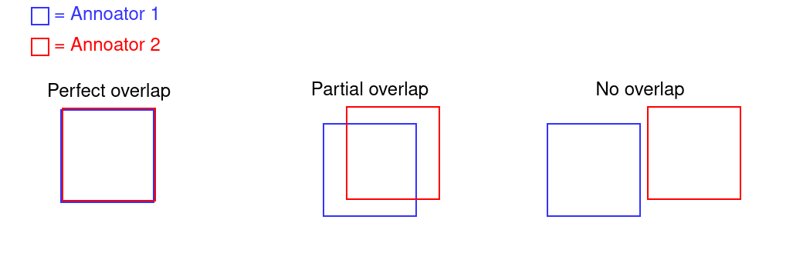
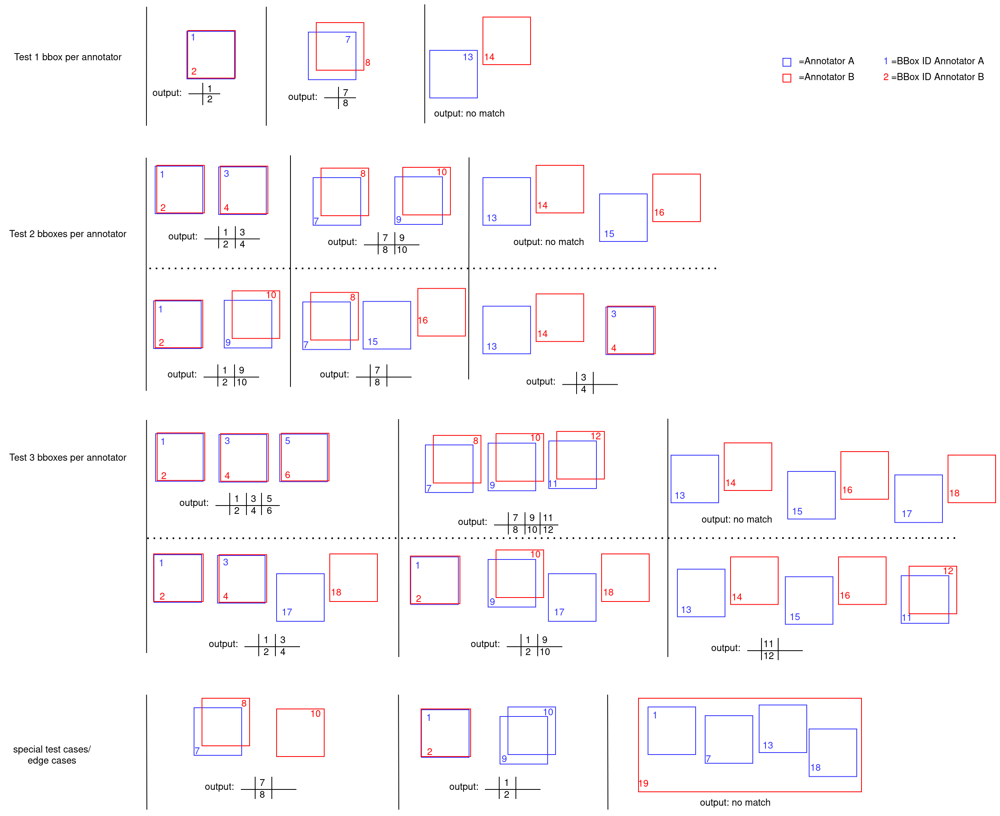
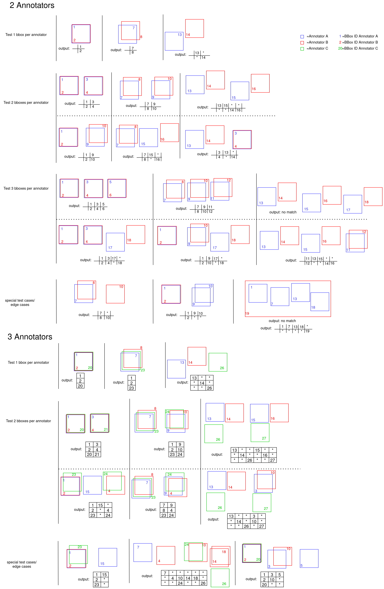
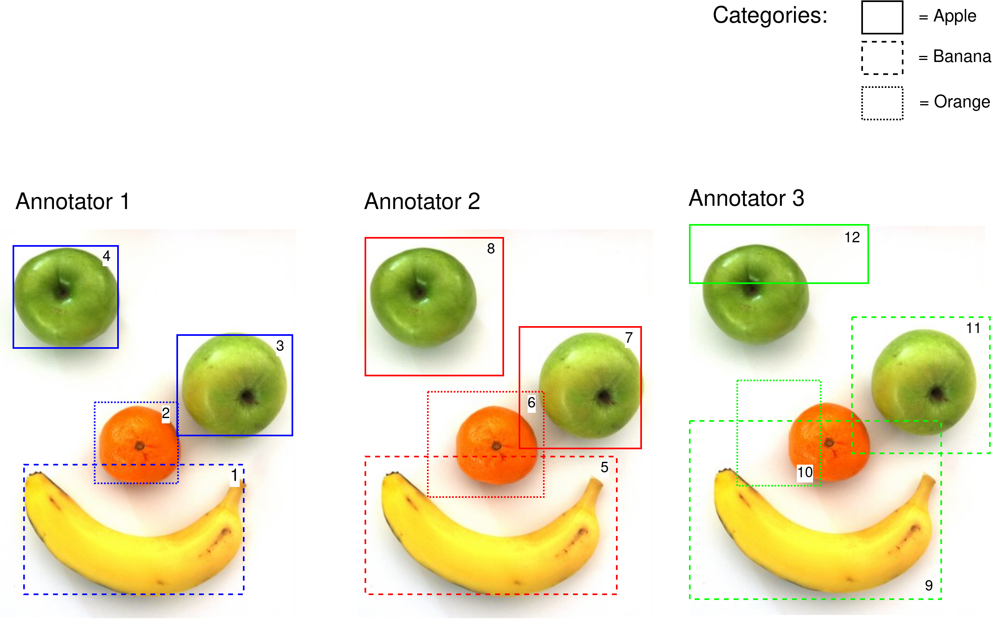
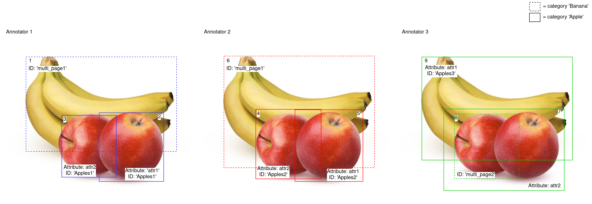
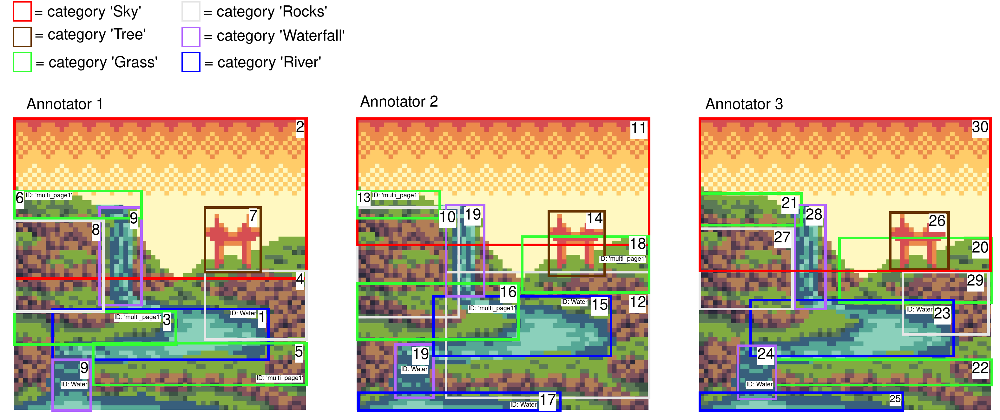

# Explanation of all Test Cases

## IoU for Bounding Boxes
IoU = Intersection over Union. \
It calculates the relation between the intersection and the union between two bounding boxes\
The Coordiantes are formatted as the following: [x,y,width,height]\
Two bounding boxes can have 3 different configurations: perfect overlap (match), parital overlap (depending on the threshold either a match or no match) and no overlap (no match)



For every of these configurations we test small medium and large bounding boxes.

### Perfect overlap
#### Small bboxes:
Coordinates Annotator A: [0,0,5,5]\
Coordinates Annotator B: [0,0,5,5]

Intersection area : [0,0,5,5] -> 5x5 = 25 (coordinate format for intersection area is  [x,y;x,y]\
Area Annotator A : [0,0,5,5] -> 5x5 = 25\
Area Annotator B : [0,0,5,5] -> 5x5 = 25
```math
IoU = \frac{intersection}{(area A + area B - intersection)}
```
```math
= 25/(25+25-25) = 1
```
#### Medium bboxes:
Coordinates Annotator A: [0,0,50,50]\
Coordinates Annotator B: [0,0,50,50]

This case is trivial like for small boxes. IoU = 1

#### Large bboxes:
Coordinates Annotator A: [0,0,500,500]\
Coordinates Annotator B: [0,0,500,500]

This case is trivial like for small boxes. IoU = 1

### Partial overlap but IoU > 0.5
#### Small bboxes:
Coordinates Annotator A: [0,0,5,5]\
Coordinates Annotator B: [1,1,5,5]

Intersection area : [1,1,5,5] -> 5-1x5-1 = 16\ 
Area Annotator A : [0,0,5,5] -> 5x5 = 25\
Area Annotator B : [1,1,5,5] -> 5x5 = 25
```math
    IoU = \frac{16}{(25+25-16)} = 0.6667
```
#### Medium bboxes:
Coordinates Annotator A: [0,5,50,50]\
Coordinates Annotator B: [5,0,50,50]

Intersection area : 50-5x50-5 = 2025\
Area Annotator A : 50x50 = 2500\
Area Annotator B : 50x50 = 2500
```math
    IoU = \frac{2025}{(2500+2500-2025)} = 0.6807
```

#### Large bboxes:
Coordinates Annotatorx A: [10,10,500,500]\
Coordinates Annotator B: [0,0,500,500]

Intersection area : 500-10x500-10 = 240100\
Area Annotator A : 500x500 = 250000\
Area Annotator B : 500x500 = 250000
```math
    IoU = \frac{240100}{(250000+250000-240100)} = 0.9238
```


### Partial overlap but IoU < 0.5

#### Small bboxes:
Coordinates Annotator A: [0,0,5,5]\
Coordinates Annotator B: [4,4,5,5]

Intersection area : 1x1 = 1\ 
Area Annotator A : 5x5 = 25\
Area Annotator B : 5x5 = 25
```math
    IoU = \frac{1}{(25+25-1)} = 0.0204
```
#### Medium bboxes:
Coordinates Annotator A: [0,5,50,50]\
Coordinates Annotator B: [40,40,50,50]

Intersection area : 10x10 = 100\
Area Annotator A : 50x50 = 2500\
Area Annotator B : 50x50 = 2500
```math
    IoU = \frac{100}{(2500+2500-100)} = 0.0204
```

#### Large bboxes:
Coordinates Annotatorx A: [70,80,500,300]\
Coordinates Annotator B: [0,0,500,500]

Intersection area : (500-70)x(380-80) = 129000\
Area Annotator A : 500x300 = 150000\
Area Annotator B : 500x500 = 250000
```math
    IoU = \frac{129000}{(150000+250000-129000)} = 0.0476
```

### No overlap
#### Small bboxes:
Coordinates Annotator A: [0,0,5,5]\
Coordinates Annotator B: [5,5,5,5]

Intersection area : 0x0 = 0 \
Area Annotator A : 5x5 = 25\
Area Annotator B : 5x5 = 25
```math
IoU = 0/(25+25-0) = 0
```
#### Medium bboxes:
Coordinates Annotator A: [100,100,50,50]\
Coordinates Annotator B: [0,0,50,50]

The intersection area is 0 so: IoU = 0

#### Large bboxes:
Coordinates Annotator A: [0,0,500,500]\
Coordinates Annotator B: [600,700,300,520]

The intersection area is 0 so: IoU = 0


## IoU for Segmentation Mask
Here we convert the segmentation mask into a 2D binary array by rasterization and then calculating the IoU by counting 
pixels as an area measure

### Perfect overlap
#### Small segmentation mask:
small_seg1 = [0, 0, 5, 2, 4, 5, 1, 4]  
small_seg2 = [0, 0, 5, 2, 4, 5, 1, 4]

The segmentations are identical, therefore their IoU is 1 
    
    
#### Medium segmentation mask:
medium_seg1 = [0, 0, 30, 40, 50, 20, 40, 50, 10, 35]  
    medium_seg2 = [0, 0, 30, 40, 50, 20, 40, 50, 10, 35]  

The segmentations are identical, therefore their IoU is 1 
#### Large segmentation mask:
large_seg1 = [0, 0, 400, 350, 500, 250, 450, 500, 20, 368]  
large_seg2 = [0, 0, 400, 350, 500, 250, 450, 500, 20, 368]

The segmentations are identical, therefore their IoU is 1 

### Partial overlap but IoU < 0.5
#### Small segmentation mask:
small_seg1 = [0, 0, 3, 0, 3, 3, 0, 3]
small_seg2 = [0, 0, 3, 0, 5, 2, 0, 3]  
Intersection Area: 13 pixel  
Union Area: 19 pixel  

IoU value = 0.6842

#### Medium segmentation mask:
medium_seg1 = [0, 0, 30, 0, 30, 30, 0, 30]  
medium_seg2 = [0, 0, 30, 0, 50, 20, 0, 30]  
Intersection Area: 856 pixel  
Union Area: 1201 pixel  

IoU value = 0.7127
#### Large segmentation mask:
large_seg1 = [200, 400, 321, 598, 468, 600, 645, 550, 512, 435, 671, 345, 397, 304]  
large_seg2 = [236, 600, 394, 343, 625, 335, 546, 442, 611, 543, 400, 600]  
Intersection Area: 60330 pixel  
Union Area: 93623 pixel  

IoU value = 0.6444

### Partial overlap but IoU > 0.5
#### Small segmentation mask:
small_seg1 = [0, 0, 3, 0, 3, 3, 0, 3]  
small_seg2 = [0, 0, 6, 0, 4, 3]
Intersection Area: 8 pixel  
Union Area: 24 pixel  

IoU value = 0.3333
#### Medium segmentation mask:
medium_seg1 = [0, 0, 0, 30, 14, 8, 30, 30, 30, 0]  
medium_seg2 = [55, 15, 45, 15, 45, 0, 35, 0, 20, 25, 55, 40]  

Intersection Area: 99 pixel  
Union Area: 1390 pixel  

IoU value = 0.0712
#### Large segmentation mask:
large_seg1 = [0, 0, 0, 140, 160, 160, 240, 0]  
large_seg2 = [100, 250, 100, 100, 450, 100, 250, 300]  
Intersection Area: 4365 pixel  
Union Area: 72902 pixel  

IoU value = 0.0599

### No overlap
#### Small segmentation mask:
small_bbox1 = [10, 10, 15, 12, 14, 15, 11, 14]  
small_bbox2 = [0, 0, 5, 2, 4, 5, 1, 4]

The segmentations have no overlap, therefore their IoU is 0 
#### Medium segmentation mask:
medium_bbox1 = [100, 100, 130, 140, 150, 120, 140, 150, 110, 135]  
medium_bbox2 = [0, 0, 30, 40, 50, 20, 40, 50, 10, 35]

The segmentations have no overlap, therefore their IoU is 0
#### Large segmentation mask:
large_bbox1 = [0, 0, 400, 350, 500, 250, 450, 500, 20, 368]  
large_bbox2 = [500, 500, 1400, 1350, 1500, 1250, 1450, 1500, 620, 1368]

The segmentations have no overlap, therefore their IoU is 0
## Krippendorff Alpha
### Test one unit per annotator:

<table>
<tr><th>Matching class </th><th>Class and empty entry</th><th>Non matching classes</th></tr>
<tr><td>

|             | Unit 1 |
|-------------|--------|
| Annotator A | 1      |
| Annotator B | 1      |

\
$`o_{1,1} = \frac{2}{2-1} = 2`$\
$`\alpha = 1- \frac{0}{\frac{1}{2-1}(2\cdot2)}= 1 `$
</td><td>

|             | Unit 1 |
|-------------|--------|
| Annotator A | 1      |
| Annotator B | *      |

\
$`o_{1,*} = \frac{1}{2-1} = 1`$\
$`\alpha = 1 - \frac{1}{\frac{1}{2-1}(1 \cdot 1)}= 1 - 1 = 0 `$
</td><td>

|             | Unit 1 |
|-------------|--------|
| Annotator A | 1      |
| Annotator B | 2      |

\
$`o_{1,2} = \frac{1}{2-1} = 1`$\
$`\alpha = 1 - \frac{1}{\frac{1}{2-1}(1 \cdot 1)}= 1 - 1 = 0 `$

</td></tr> </table>


### Test two units per annotator:
<table>
<tr><th>Matching classes </th><th>Non machting classes</th></tr>
<tr><td>

|             | Unit 1 | Unit 2 |
|-------------|--------|--------|
| Annotator A | 1      | 2      |
| Annotator B | 1      | 2      |

\
$`o_{1,1} = \frac{2}{2-1} = 2`$\
$`o_{2,2} = \frac{2}{2-1} = 2`$

|         | 1   | 2   | sum |
|---------|-----|-----|-----|
| Value 1 | 2   |     | 2   |
| Value 2 |     | 2   | 2   |
|         | 2   | 2   | 4   |

\
$`\alpha = 1 - \frac{0}{\frac{1}{4-1}(2 \cdot 2)}= 1 - 0 = 1 `$

</td><td>

|             | Unit 1 | Unit 2 |
|-------------|--------|--------|
| Annotator A | 1      | 2      |
| Annotator B | 2      | *      |

\
$`o_{1,2} = \frac{1}{2-1} = 1`$\
$`o_{2,*} = \frac{1}{2-1} = 1`$

|         | 1   | 2   | *   | sum |
|---------|-----|-----|-----|-----|
| Value 1 |     | 1   |     | 1   |
| Value 2 | 1   |     | 1   | 2   |
| Value * |     | 1   |     | 1   |
|         |     |     |     | 4   |

\
$`\alpha = 1 - \frac{0}{\frac{1}{4-1}(1 \cdot 2 + 1 \cdot 1 + 2 \cdot 1)}= 1 - 1.2 = 0.2 `$

</td></tr> </table>

### Test three units per annotator:

#### Correct matching
|             | Unit 1 | Unit 2 | Unit 3 |
|-------------|--------|--------|--------|
| Annotator A | 1      | 2      | 3      |
| Annotator B | 1      | 2      | 3      |

\
There is no class mismatch, therefore the krippendorff alpha value will always be 1.

#### Malicious matching

<table>
<tr><th> Reliability data</th><th> Coincidence matrix</th></tr>
<tr><td>

|             | Unit 1 | Unit 2 | Unit 3 |
|-------------|--------|--------|--------|
| Annotator A | 1      | 2      | 3      |
| Annotator B | 1      | *      | 1      |

\
$`o_{1,1} = \frac{2}{2-1} = 2`$\
$`o_{2,*} = \frac{1}{2-1} = 1`$\
$`o_{3,1} = \frac{1}{2-1} = 1`$
</td>
<td>

|         | 1   | 2   | 3   | *   | sum |
|---------|-----|-----|-----|-----|-----|
| Value 1 | 2   |     | 1   |     | 3   |
| Value 2 |     |     |     | 1   | 1   |
| Value 3 | 1   |     |     |     | 1   |
| Value * |     | 1   |     |     | 1   |
| sum     | 3   | 1   | 1   | 1   | 6   |

</td>
</tr>

$`\alpha = 1 - \frac{1+1}{\frac{1}{6-1}12}= 1 - 0.8333 = 0.1667 `$

</table>

### Test five units per annotator:

#### Correct matching
|             | Unit 1 | Unit 2 | Unit 3 | Unit 4 | Unit 5 |
|-------------|--------|--------|--------|--------|--------|
| Annotator A | 1      | 2      | 3      | 1      | 2      |
| Annotator B | 1      | 2      | 3      | 1      | 2      |

\
There is no class mismatch, therefore the krippendorff alpha value will always be 1.

#### Malicious matching

<table>
<tr><th> Reliability data</th><th> Coincidence matrix</th></tr>
<tr><td>

|             | Unit 1 | Unit 2 | Unit 3 | Unit 4 | Unit 5 |
|-------------|--------|--------|--------|--------|--------|
| Annotator A | 1      | *      | 3      | 1      | 2      |
| Annotator B | 1      | 3      | *      | 2      | 2      |

\
$`o_{1,1} = \frac{2}{2-1} = 2`$\
$`o_{1,2} = \frac{1}{2-1} = 1`$\
$`o_{2,2} = \frac{2}{2-1} = 2`$\
$`o_{3,*} = \frac{1}{2-1} + \frac{1}{2-1} = 1+1 = 2`$

</td>
<td>

|         | 1   | 2   | 3   | *   | sum |
|---------|-----|-----|-----|-----|-----|
| Value 1 | 2   | 1   |     |     | 3   |
| Value 2 | 1   | 2   |     |     | 3   |
| Value 3 |     |     |     | 2   | 2   |
| Value * |     |     | 2   |     | 2   |
| sum     | 3   | 3   | 2   | 2   | 10  |

</td>
</tr>

$`\alpha = 1 - \frac{1+2}{\frac{1}{10-1}37}= 1 - 0.73 = 0.27 `$

</table>

### Test ten units per annotator:

#### Correct matching
|             | Unit 1 | Unit 2 | Unit 3 | Unit 4 | Unit 5 | Unit 6 | Unit 7 | Unit 8 | Unit 9 | Unit 10 |
|-------------|--------|--------|--------|--------|--------|--------|--------|--------|--------|---------|
| Annotator A | 1      | 2      | 3      | 1      | 2      | 1      | 2      | 3      | 1      | 2       |
| Annotator B | 1      | 2      | 3      | 1      | 2      | 1      | 2      | 3      | 1      | 2       |

\
There is no class mismatch, therefore the krippendorff alpha value will always be 1.
#### Malicious matching 10 Units
Reliability data

|       | Unit 1 | Unit 2 | Unit 3 | Unit 4 | Unit 5 | Unit 6 | Unit 7 | Unit 8 | Unit 9 | Unit 10 |
|-------|--------|--------|--------|--------|--------|--------|--------|--------|--------|---------|
| Ann A | 1      | 2      | *      | 1      | 2      | 1      | 6      | 8      | 3      | *       |
| Ann B | *      | 2      | 1      | 2      | 2      | 5      | 6      | 7      | 3      | 2       |

\
$`o_{1,0} = \frac{1}{2-1}+\frac{1}{2-1} = 1+1=2`$\
$`o_{1,2} = \frac{1}{2-1} = 1`$\
$`o_{1,5} = \frac{1}{2-1} = 1`$\
$`o_{2,2} = \frac{2}{2-1}+\frac{2}{2-1} = 2+2 = 4`$\
$`o_{2,0} = \frac{1}{2-1} = 1`$\
$`o_{6,6} = \frac{2}{2-1} = 2`$\
$`o_{7,8} = \frac{1}{2-1} = 1`$\
$`o_{3,3} = \frac{2}{2-1} = 2`$


 Coincidence matrix

|         | 1   | 2   | 3   | 5   | 6   | 7   | 8   | *   | sum |
|---------|-----|-----|-----|-----|-----|-----|-----|-----|-----|
| Value 1 |     | 1   |     | 1   |     |     |     | 2   | 4   |
| Value 2 | 1   | 4   |     |     |     |     |     | 1   | 6   |
| Value 3 |     |     | 2   |     |     |     |     |     | 2   |
| Value 5 | 1   |     |     |     |     |     |     |     | 1   |
| Value 6 |     |     |     |     | 2   |     |     |     | 2   |
| Value 7 |     |     |     |     |     |     | 1   |     | 1   |
| Value 8 |     |     |     |     |     | 1   |     |     | 1   |
| Value * | 2   | 1   |     |     |     |     |     |     | 3   |
| sum     | 4   | 6   | 2   | 1   | 2   | 1   | 1   | 3   | 20  |


$`\alpha = 1 - \frac{2+1+1+1+1}{\frac{1}{20-1}164} = 0.3049 `$

#### Malicious matching 20 Units
Reliability data

|       | Unit 1 | Unit 2 | Unit 3 | Unit 4 | Unit 5 | Unit 6 | Unit 7 | Unit 8 | Unit 9 | Unit 10 | Unit 11 | Unit 12 | Unit 13 | Unit 14 | Unit 15 | Unit 16 | Unit 17 | Unit 18 | Unit 19 | Unit 20 |
|-------|--------|--------|--------|--------|--------|--------|--------|--------|--------|---------|---------|---------|---------|---------|---------|---------|---------|---------|---------|---------|
| Ann A | 1      | 2      | *      | 1      | 2      | 1      | 6      | 8      | 3      | *       | 1       | 2       | 3       | 1       | 2       | 1       | 2       | 3       | 1       | 5       |
| Ann B | *      | 2      | 1      | 2      | 2      | 5      | 6      | 7      | 3      | 2       | 1       | 2       | 6       | 2       | 5       | 1       | *       | 3       | 1       | 5       |

\
$`o_{1,*} = \frac{1}{2-1}+\frac{1}{2-1} = 1+1=2`$\
$`o_{2,*} = \frac{1}{2-1}+\frac{1}{2-1} = 1+1=2`$\
$`o_{1,1} = \frac{2}{2-1}+\frac{2}{2-1} +\frac{2}{2-1}  = 6`$\
$`o_{1,2} = \frac{1}{2-1} = 1`$\
$`o_{2,2} = \frac{2}{2-1}+\frac{2}{2-1}+\frac{2}{2-1} = 6`$\
$`o_{1,5} = \frac{1}{2-1} = 1`$\
$`o_{5,5} = \frac{2}{2-1} = 2`$\
$`o_{2,5} = \frac{1}{2-1} = 1`$\
$`o_{6,6} = \frac{2}{2-1} = 2`$\
$`o_{7,8} = \frac{1}{2-1} = 1`$\
$`o_{3,3} = \frac{2}{2-1} = 2`$\
$`o_{3,6} = \frac{1}{2-1} = 1`$


 Coincidence matrix

|         | *   | 1   | 2   | 3   | 5   | 6   | 7   | 8   | sum |
|---------|-----|-----|-----|-----|-----|-----|-----|-----|-----|
| Value * |     | 2   | 2   |     |     |     |     |     | 4   |
| Value 1 | 2   | 6   | 2   |     | 1   |     |     |     | 11  |
| Value 2 | 2   | 2   | 6   |     | 1   |     |     |     | 11  |
| Value 3 |     |     |     | 4   |     | 1   |     |     | 5   |
| Value 5 |     | 1   | 1   |     | 2   |     |     |     | 4   |
| Value 6 |     |     |     | 1   |     | 2   |     |     | 3   |
| Value 7 |     |     |     |     |     |     |     | 1   | 1   |
| Value 8 |     |     |     |     |     |     | 1   |     | 1   |
| sum     | 4   | 11  | 11  | 5   | 4   | 3   | 1   | 1   | 40  |


$`\alpha = 1 - \frac{2+2+1+1+1+1+1+1}{\frac{1}{40-1}645} = 0.3953 `$

## Hungarian Matching


## Recursive Matching


## Test Examples (Fruits and Landscape)
### Smiling Fruits
The following shows the annotation of apples and bananas for 3 annotators\


#### Hungarian Matching:
For annotator 1, 2 and 3 match BBox:

|      | unit 1 | unit 2 | unit 3 | unit 3 |
|------|--------|--------|--------|--------|
| Ann1 | 1      | 2      | 3      | 4      |
| Ann2 | 5      | 6      | 7      | 8      |

|      | unit 1 | unit 2  |
|------|--------|---------|
| Ann1 | 1      | 3       |
| Ann3 | 9      | 11      |

|      | unit 1 | unit 2 | unit 2 |
|------|--------|--------|--------|
| Ann2 | 5      | 6      | 7      |
| Ann3 | 9      | 10     | 11     |

#### Recursive Matching
|      | unit 1 | unit 2 | unit 3 | unit 4 | unit 5 |
|------|--------|--------|--------|--------|--------|
| Ann1 | 1      | 2      | 3      | 4      | -1     |
| Ann2 | 5      | 6      | 7      | 8      | -1     |
| Ann3 | 9      | 10     | 11     | -1     | 12     |
#### Krippendorff
Coincidence Matrix:

|     | 1   | 2   | 3   | 0   | sum |
|-----|-----|-----|-----|-----|-----|
| 1   | 2   | 1   |     | 2   | 5   |
| 2   | 1   | 3   |     |     | 4   |
| 3   |     |     | 3   |     | 3   |
| 0   | 2   |     |     | 1   | 3   |
| sum |     |     |     |     | 15  |

alpha = $`\alpha = 1 - \frac{1+2}{\frac{1}{15-1} 83} = 1 - 0.5060 = 0.494 `$


### Fruits



Link to the image: <sub><sup>https://media.gettyimages.com/photos/bunch-of-ripe-bananas-and-apples-isolated-on-a-white-background-picture-id898671450?b=1&k=20&m=898671450&s=170667a&w=0&h=-DDTvuGwu6QaBTzLNUCkO3ogJ04MtnG0JTT6vNG_IxE=</sup></sub>

#### IoU:
IoU for BBox 1 and 6 = 0.84\
IoU for BBox 1 and 9 = 0.8808\
IoU for BBox 2 and 5 = 0.9689\
IoU for bbox 3 and 4 = 0.8388\

#### Hungarian Matching:
For annotator 1, 2 and 3 match BBox:

|      | unit 1 | unit 2 | unit 3 |
|------|--------|--------|--------|
| Ann1 | 1      | 2      | 3      |
| Ann2 | 6      | 5      | 4      |

|      | unit 1 | unit 2 |
|------|--------|--------|
| Ann1 | 1      | 3      |
| Ann3 | 9      | 8      |

|      | unit 1 | unit 2 |
|------|--------|--------|
| Ann2 | 4      | 6      |
| Ann3 | 8      | 9      |

#### Recursive Matching
|      | unit 1 | unit 2 | unit 3 | unit 4 |
|------|--------|--------|--------|--------|
| Ann1 | 1      | 2      | 3      | -1     |
| Ann2 | 6      | 5      | 4      | -1     |
| Ann3 | 9      | -1     | 8      | 7      |

#### Krippendorff
Coincidence Matrix:

|     | 0 | 1 | 2 | sum |
|-----|---|---|---|-----|
| 0   | 1 | 2 |   | 3   |
| 1   | 2 | 2 | 2 | 6   |
| 2   |   | 2 | 1 | 3   |
| sum |   |   |   | 12  |

alpha = $`\alpha = 1 - \frac{2+2}{\frac{1}{12-1}3\cdot 6 + 3 \cdot 3 + 6 \cdot 3} = 1 - 0.977 = 0.022 `$

### Example Landscape



source: https://pbs.twimg.com/media/D3LtqoGVYAA99bt.jpg


#### Coincidence Matrix
|      | Unit 1 | Unit 2 | Unit 3 | Unit 4 | Unit 5 | Unit 6 | Unit 7 | Unit 8 | Unit 9 | Unit 10 | Unit 11 | Unit 12 | Unit 13 | Unit 14 |
|------|--------|--------|--------|--------|--------|--------|--------|--------|--------|---------|---------|---------|---------|---------|
| Ann1 | 1      | 2      | 3      | 4      | 5      | 6      | 7      | 8      | 9      | -1      | -1      | -1      | -1      | -1      |
| Ann2 | 15     | 11     | 16     | -1     | -1     | 13     | 14     | 10     | 19     | 12      | 17      | 18      | -1      | -1      |
| Ann3 | 23     | 30     | -1     | 29     | 22     | 21     | 26     | 27     | -1     | -1      | 25      | 20      | 24      | 28      |
